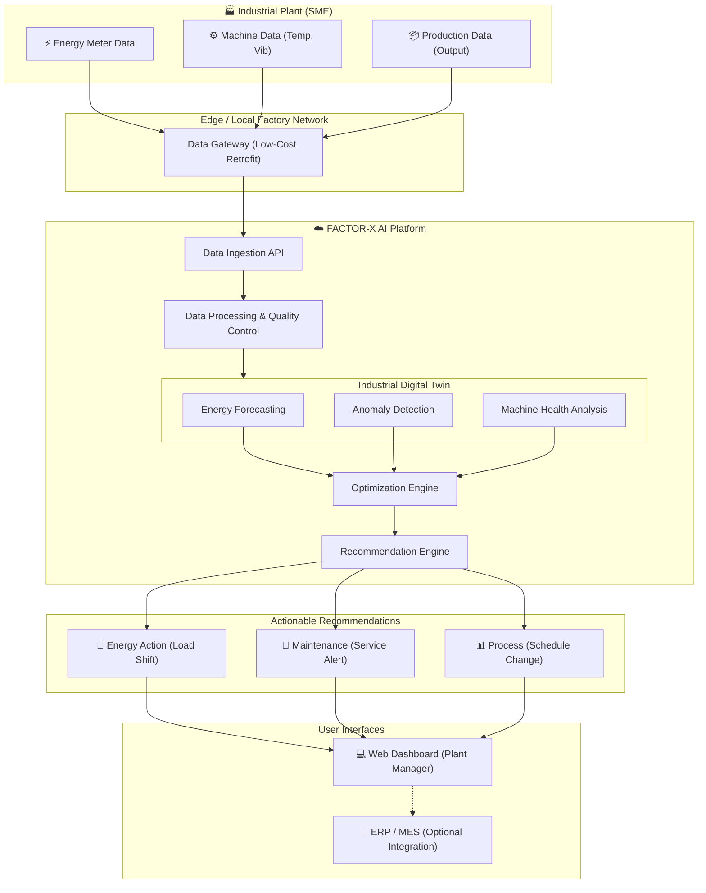

# FACTOR-X: AI-Powered Industrial Energy & Process Optimization

**Target Audience:** Indian SMEs (Textile manufacturing, Machine shops, Plastics)
**Core Philosophy:** *Don't replace the factory. Make the existing factory intelligent.*

---

## 1. Detailed Solution Write-up
Indian SMEs face a unique set of challenges: low capital expenditure bandwidth, ageing machinery, limited technical staff, and an inability to halt production for massive retrofits. 

**The Mechanism:** 
FACTOR-X retrofits intelligence onto existing equipment. It ingests three streams of data (Energy, Machine health like vibration/temperature, and Production output) via a low-cost IoT edge gateway. 
The AI analyzes this data to establish a baseline and identify deviations. For example, if a motor consumes unusually high energy during a specific operating condition (idling or high friction), the system flags it, correlates it with production loads, estimates the wasted energy, and recommends a specific operational or maintenance intervention.

**The Result:** Reduced energy consumption per unit of production (SEC - Specific Energy Consumption), preserving product quality and throughput.

---

## 2. System Architecture
FACTOR-X bridges the physical factory and cloud AI without requiring heavy on-premise servers.

---

## 3. Supporting Design Artefacts
We have designed a web-based **Energy Intelligence Dashboard** for Plant Managers.
*See `dashboard/index.html` for the interactive prototype.*

**Key Features:**
*   **KPIs:** Total Energy, SEC (kWh/u), Estimated CO₂ Offset, Average Machine Health.
*   **Energy Consumption Trend:** Visualizes Baseline vs. Optimized energy usage.
*   **AI Anomaly Alerts:** Flags issues like "Motor-03 Anomaly: High friction (Temp: 78°C). Idling power +40% above baseline."
*   **Optimization Actions:** Provides 1-click recommendations (e.g., "Schedule Motor-03 Service", "Implement Load Shifting") with estimated ₹ savings.

---

## 4. Quantified Improvement (Simulation Results)
To prove the mechanism, we developed a Python-based Digital Twin simulation (`scripts/simulate_factory_data.py`) modeling 30 days of factory operation (720 hours) for a multi-motor setup where one motor degrades and idles inefficiently.

**Pre-Intervention (Baseline):**
*   **Total Production:** 4,853 units
*   **Baseline Energy:** 58,038.57 kWh
*   **Baseline SEC:** 11.96 kWh/unit

**AI Intervention Applied:**
The AI detects Motor-3's high idling power and temperature. Maintenance is performed, restoring it to a healthy state, and minor load shifting is applied to reduce peak waste.

**Post-Intervention (Optimized):**
*   **Total Production:** 4,853 units (0% change in production/quality)
*   **Optimized Energy:** 46,444.73 kWh
*   **Optimized SEC:** 9.57 kWh/unit

**Final Impact:**
*   **Energy Reduction:** **19.98%** (SEC improved by ~20%)
*   *(Note: This represents a simulated backtest to demonstrate the platform's mathematical mechanism.)*

---

## 5. Deployment + Business Model
**Target Industrial Segment:** Textile SMEs. Textile manufacturing involves heavy, continuous motor and compressor usage where minor friction or idling leads to massive energy bills. 

**Installation & Scale-up:**
1.  **Phase 1:** Clamp-on CT sensors and basic vibration monitors are retrofitted. No machine replacement.
2.  **Phase 2:** Low-cost IoT gateway syncs data to the Factor-X cloud.
3.  **Phase 3:** AI establishes a baseline (2-4 weeks) and begins generating ROI immediately.

**SaaS Business Model (Example Pricing):**
*   **Starter (₹5,000/month):** Basic energy monitoring, simple dashboard, monthly reports. Payback period: ~2 months through basic visibility.
*   **Professional (₹15,000/month):** AI forecasting, anomaly detection, predictive maintenance alerts, and optimization recommendations. Payback period: < 1 month due to massive SEC improvements.
*   **Enterprise (Custom):** ERP/MES integration, multiple plants, API access.
